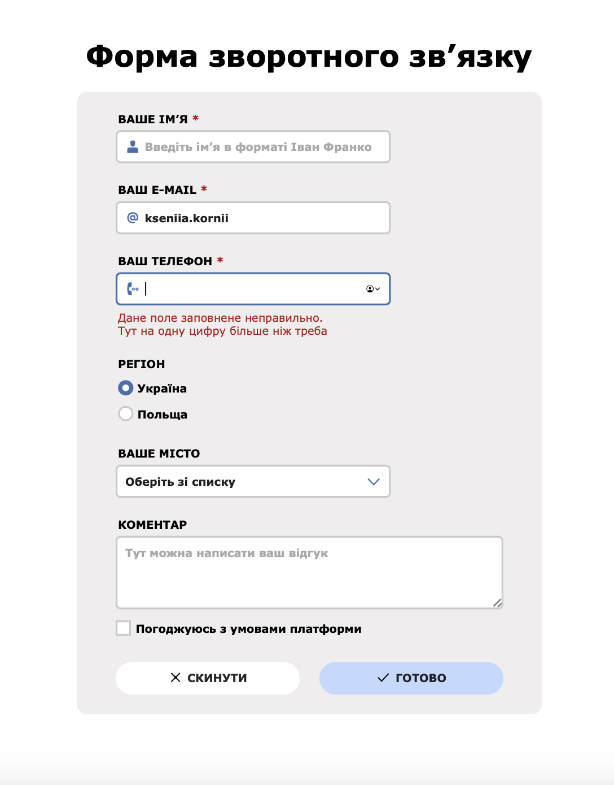

# Creating the form: case study for Creative Practice #3

## The outlines
As a UX/UI designer, it was important for me to learn the basics of the front-end for my work to:
* Build better ideas based on feasible solutions
* Know the potential boundaries, what’s possible/impossible to create
* To be more effective in working with the development team and understand their language

I started studying at Creative Practice and have already learned Visual Studio Code, the basic principles of HTML, and some tags. In previous classes, I've found out how to connect CSS, make tables, and work with the block model, CSS selectors, pseudo-classes, pseudo-elements, and cross-platform. Also, I got acquainted with the flexboxes, grids, and position of elements.

## The goal
Learn how to create and style common form elements.

## The process and the result
1. I made up the form based on a design layout.
2. I created text fields containing icons and placeholder text.
3. I used the selector to style the input field when it gets focus.
4. I added labels to the fields, textarea to the form, and the corresponding property for required fields.
5. I added radio buttons, checkboxes, and the submit&reset buttons to the form and styled their appearance in different states.
